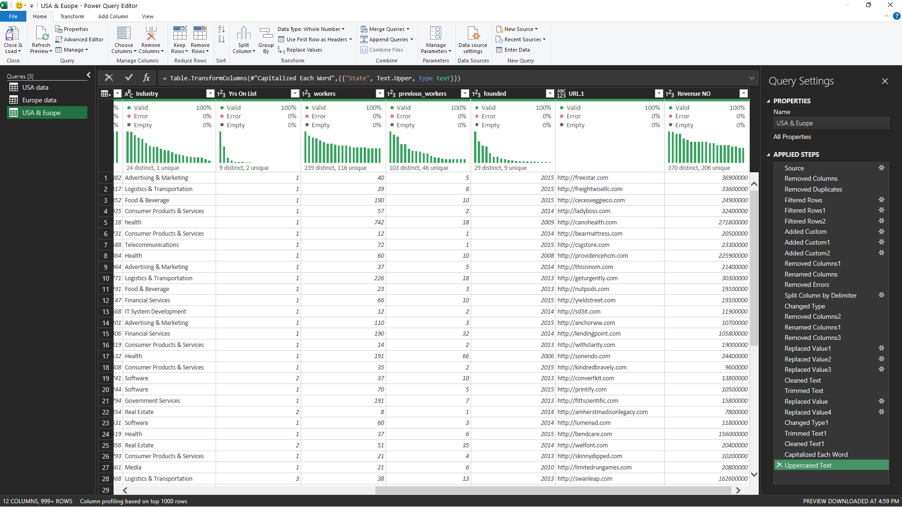

# Data Cleaning using Excel Power Query

## Project Overview
This project focuses on cleaning and preparing a dataset of companies from the USA and Europe using Excel Power Query.

The goal of this project is to transform raw data into a clean and analysis-ready dataset.

---

## Dataset
The dataset contains information about companies including:

- Company Name
- State
- City
- Industry
- Growth
- Years on List
- Number of Workers
- Previous Workers
- Founded Year
- Website URL
- Revenue

---

## Data Cleaning Steps

The following cleaning operations were performed using Power Query:

1. Removed unnecessary columns
2. Removed duplicate records
3. Filtered invalid rows
4. Split location column into separate columns (Country, State, City)
5. Removed the Country column since all values were "United States"
6. Standardized text fields (Industry, City, etc.)
7. Cleaned text values using Trim and Clean functions
8. Fixed URL format to ensure all links start with `http://` and end with `.com`
9. Converted Revenue values from "Million" text format into numeric values
10. Removed errors from the dataset
11. Changed data types for numerical columns

---

## Tools Used

- Microsoft Excel
- Power Query
- GitHub

---

## Project Outcome

The final dataset is fully cleaned and structured, making it ready for:

- Data analysis
- Visualization
- Business insights

---

## Screenshot

Power Query transformation steps:

---

## Author

Data Cleaning Project by: Shimaa Emad
